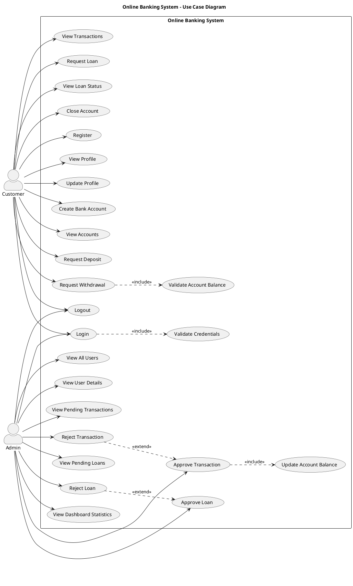
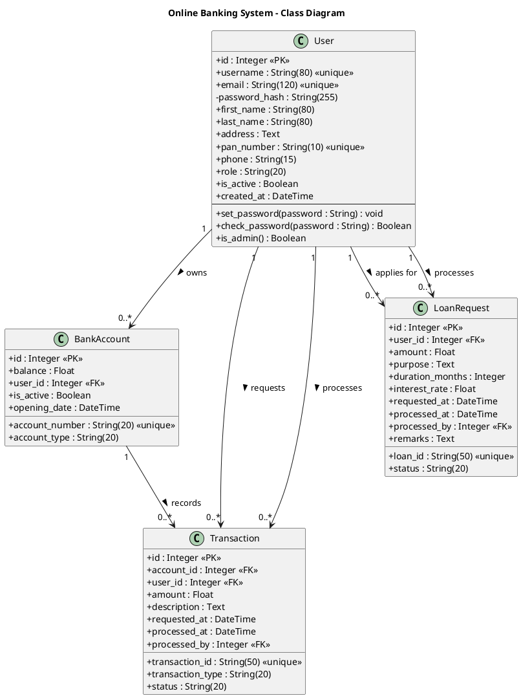

# UML Diagrams – Online Banking System

**Course:** Software Engineering
**Student:** Prakhar Rohatsgi, I
**Roll No:** 2023 00 283
**Section:** BE1
**Date:** 06/04/26

---

## Overview

This document presents the four core UML diagrams for the Online Banking System. The system is built using Python (Flask) and supports two roles:

- **Customer** – can register, manage bank accounts, request deposits/withdrawals, and apply for loans.
- **Admin** – can review user accounts, approve or reject transactions and loan requests, and monitor dashboard statistics.

---

## 1. Use Case Diagram

### Definition

A **Use Case Diagram** is a behavioural UML diagram that captures the functional requirements of a system by showing how external users (*actors*) interact with it through named *use cases*. It defines the system boundary and describes what the system *does* – not how it does it.

### Components

| Component | Notation | Description |
|-----------|----------|-------------|
| **Actor** | Stick figure | An external entity (person or system) that interacts with the system. Primary actors initiate use cases; secondary actors respond. |
| **Use Case** | Named ellipse | A unit of functionality that produces an observable result for an actor. |
| **System Boundary** | Rectangle | Encloses all use cases; defines the scope of the system. |
| **Association** | Solid line | Connects an actor to a use case it participates in. |
| **<<include>>** | Dashed arrow with label | Mandatory inclusion – the base use case *always* invokes the included use case. |
| **<<extend>>** | Dashed arrow with label | Optional extension – the extending use case *conditionally* adds behaviour to the base use case. |
| **Generalization** | Solid arrow (closed head) | Indicates that a child actor or use case inherits from a parent. |

### Actors

| Actor | Type | Description |
|-------|------|-------------|
| **Customer** | Primary | A registered user who performs banking operations (deposits, withdrawals, loans). |
| **Admin** | Primary | A bank employee who oversees transactions, loans, and user accounts. |

### Use Cases Summary

#### Customer Use Cases
- Register
- Login / Logout
- View Profile, Update Profile
- Create Bank Account, View Accounts, Close Account
- Request Deposit, Request Withdrawal, View Transactions
- Request Loan, View Loan Status

#### Admin Use Cases
- Login / Logout
- View All Users, View User Details
- View Pending Transactions, Approve Transaction, Reject Transaction
- View Pending Loans, Approve Loan, Reject Loan
- View Dashboard Statistics

### Diagram

The source is in [`use_case_diagram.puml`](use_case_diagram.puml).



---

## 2. Class Diagram

### Definition

A **Class Diagram** is a structural UML diagram that depicts the static structure of a system: the classes, their attributes (data), methods (behaviour), and the relationships between them. It is the foundation for object-oriented design and maps directly to the database schema and code models.

### Components

| Component | Notation | Description |
|-----------|----------|-------------|
| **Class** | Rectangle with three compartments (name / attributes / methods) | Represents an entity with shared structure and behaviour. |
| **Attribute** | `+ / - / # name : Type` | A data field; `+` = public, `-` = private, `#` = protected. |
| **Method** | `+ name(params) : ReturnType` | An operation the class can perform. |
| **Association** | Solid line with optional multiplicity | A general relationship between classes. |
| **Aggregation** | Hollow diamond | A "has-a" relationship where the part can exist independently. |
| **Composition** | Filled diamond | A strong "has-a" relationship where the part cannot exist without the whole. |
| **Dependency** | Dashed arrow | One class uses or depends on another. |
| **Multiplicity** | Numbers at line ends (e.g., `1`, `0..*`) | Defines how many instances participate in the relationship. |

### Classes

| Class | Table | Description |
|-------|-------|-------------|
| `User` | `users` | Represents both customers and administrators. |
| `BankAccount` | `bank_accounts` | A bank account owned by a user. |
| `Transaction` | `transactions` | A deposit or withdrawal request on an account. |
| `LoanRequest` | `loan_requests` | A loan application submitted by a customer. |

### Relationships

| Relationship | Multiplicity | Description |
|--------------|-------------|-------------|
| `User` → `BankAccount` | 1 to 0..* | A user can own many bank accounts. |
| `User` → `Transaction` | 1 to 0..* | A user can request many transactions. |
| `User` → `LoanRequest` | 1 to 0..* | A user can apply for many loans. |
| `BankAccount` → `Transaction` | 1 to 0..* | An account can have many transaction records. |
| `User` (Admin) → `Transaction` | 1 to 0..* | An admin processes (approves/rejects) many transactions. |
| `User` (Admin) → `LoanRequest` | 1 to 0..* | An admin processes many loan requests. |

### Diagram

The source is in [`class_diagram.puml`](class_diagram.puml).



---

## 3. Activity Diagram

### Definition

An **Activity Diagram** is a behavioural UML diagram that models the dynamic flow of activities (actions and decisions) within a system or process. It is similar to a flowchart but supports concurrent (parallel) activities and swim lanes to partition responsibilities among different actors or system components.

### Components

| Component | Notation | Description |
|-----------|----------|-------------|
| **Initial Node** | Filled circle | Starting point of the flow. |
| **Activity (Action)** | Rounded rectangle | A step or task in the process. |
| **Decision Node** | Diamond | A branching point; outgoing edges carry guard conditions `[condition]`. |
| **Merge Node** | Diamond | Rejoins branches from a decision. |
| **Fork / Join** | Thick horizontal bar | Splits into parallel flows (fork) or synchronises them (join). |
| **Swim Lane (Partition)** | Vertical or horizontal band | Groups activities by the responsible actor or component. |
| **Final Node** | Filled circle within a ring | End of the flow. |
| **Control Flow** | Solid arrow | Direction of flow between activities. |

### Flow Described

The diagram models the **Transaction Request and Approval Flow**:

1. **Customer** logs in with credentials.
2. **System** validates the credentials.
3. If valid, the customer selects an account and chooses a transaction type (deposit or withdrawal).
4. If a withdrawal, the **System** validates that sufficient balance exists.
5. A `Transaction` record is persisted with `status = 'pending'`.
6. **Admin** reviews the pending transaction and decides to approve or reject.
7. On approval, the system updates the account balance and marks the transaction as `'approved'`.
8. On rejection, the system records remarks and marks the transaction as `'rejected'`.
9. The **Customer** can subsequently view the updated transaction status.

### Diagram

The source is in [`activity_diagram.puml`](activity_diagram.puml).

```plantuml
@startuml activity_diagram
title Online Banking System - Activity Diagram
       (Transaction Request and Approval Flow)

|Customer|
start
:Open Online Banking Application;
:Enter Username & Password;

|System|
:Validate Credentials;

|Customer|
if (Valid Credentials?) then (Yes)
    :View Dashboard;
    :Select Bank Account;
    :Choose Transaction Type (Deposit / Withdrawal);
    :Enter Amount & Description;

    |System|
    if (Transaction Type == Withdrawal?) then (Yes)
        :Check Account Balance;
        if (Sufficient Balance?) then (No)
            :Show "Insufficient Funds" Error;
            |Customer|
            stop
        else (Yes)
        endif
    endif
    :Create Transaction Record (status = pending);
    :Return Confirmation to Customer;

    |Customer|
    :View Transaction Submitted Message;

    |Admin|
    :Login to Admin Panel;
    :View Pending Transactions;
    :Select a Pending Transaction;
    :Review Transaction Details;

    if (Approve Transaction?) then (Approve)
        |System|
        if (Transaction Type == Deposit?) then (Yes)
            :Add Amount to Account Balance;
        else (No - Withdrawal)
            :Deduct Amount from Account Balance;
        endif
        :Update Transaction Status = Approved;
        :Record Processed At & Processed By;
    else (Reject)
        |System|
        :Update Transaction Status = Rejected;
        :Store Rejection Remarks;
    endif

    |Customer|
    :View Updated Transaction Status;
else (No)
    |System|
    :Return "Invalid Credentials" Error;
    |Customer|
    :View Error Message;
endif

stop
@enduml
```

---

## 4. Sequence Diagram

### Definition

A **Sequence Diagram** is a behavioural UML diagram that illustrates how objects (or components) interact with one another in a particular scenario over time. It emphasises the *order* of messages passed between participants along a vertical time axis. It is especially useful for documenting API call chains, event-driven flows, and multi-tier architectures.

### Components

| Component | Notation | Description |
|-----------|----------|-------------|
| **Lifeline** | Named box at top + dashed vertical line | Represents a participant (object, component, or actor) in the interaction. |
| **Activation Bar** | Thin rectangle on a lifeline | Shows the period during which a participant is executing. |
| **Synchronous Message** | Solid arrow with filled head | Caller waits for the response before continuing. |
| **Return Message** | Dashed arrow | Response to a previous synchronous message. |
| **Self-Call** | Arrow looping back to the same lifeline | A participant calls one of its own methods. |
| **Combined Fragment – alt** | Rectangle labelled `alt` with dashed divider | Models conditional branches (if/else). |
| **Combined Fragment – loop** | Rectangle labelled `loop` | Models repeated behaviour. |
| **Combined Fragment – ref** | Rectangle labelled `ref` | References another sequence diagram. |

### Scenario Described

The diagram models the complete **Deposit Request and Admin Approval** lifecycle:

1. **Customer** authenticates via `POST /api/login`.
2. **System** validates credentials against the database and returns a session.
3. Customer fetches their accounts via `GET /api/user/accounts`.
4. Customer submits a deposit request via `POST /api/user/transaction/deposit`.
5. System persists the `Transaction` with `status = 'pending'` and returns a confirmation.
6. **Admin** authenticates and retrieves pending transactions via `GET /api/admin/transactions/pending`.
7. Admin approves a specific transaction via `POST /api/admin/transaction/{id}/approve`.
8. System checks transaction type; for a deposit it adds to the account balance; for a withdrawal it first validates balance sufficiency.
9. System updates the transaction status to `'approved'`, records `processed_at` and `processed_by`.
10. **Customer** later queries `GET /api/user/transactions` and sees the updated `'approved'` status.

### Diagram

The source is in [`sequence_diagram.puml`](sequence_diagram.puml).

```plantuml
@startuml sequence_diagram
title Online Banking System - Sequence Diagram
       (Deposit Request and Admin Approval Flow)

actor Customer
participant "Flask API\n(auth.py)" as AuthAPI
participant "Flask API\n(user_routes.py)" as UserAPI
participant "Flask API\n(admin_routes.py)" as AdminAPI
database "Database" as DB
actor Admin

== Authentication ==
Customer -> AuthAPI : POST /api/login {username, password}
AuthAPI -> DB : Query User by username
DB --> AuthAPI : User record
AuthAPI -> AuthAPI : check_password(hash)
alt Valid Credentials
    AuthAPI --> Customer : 200 OK {user_id, username, role}
else Invalid Credentials
    AuthAPI --> Customer : 401 Unauthorized
end

== Request Deposit ==
Customer -> UserAPI : GET /api/user/accounts
UserAPI -> DB : Query BankAccount WHERE user_id = current_user.id
DB --> UserAPI : List of accounts
UserAPI --> Customer : 200 OK {accounts: [...]}

Customer -> UserAPI : POST /api/user/transaction/deposit {account_id, amount}
UserAPI -> DB : Validate BankAccount ownership
DB --> UserAPI : Account record
UserAPI -> DB : INSERT Transaction (status='pending')
DB --> UserAPI : Transaction created
UserAPI --> Customer : 201 Created {transaction_id, status='pending'}

== Admin Approves Transaction ==
Admin -> AuthAPI : POST /api/login {username, password}
AuthAPI --> Admin : 200 OK {role='admin'}

Admin -> AdminAPI : GET /api/admin/transactions/pending
AdminAPI -> DB : Query Transactions WHERE status='pending'
DB --> AdminAPI : Pending transactions list
AdminAPI --> Admin : 200 OK {transactions: [...]}

Admin -> AdminAPI : POST /api/admin/transaction/{id}/approve
AdminAPI -> DB : Query Transaction by id
DB --> AdminAPI : Transaction record
AdminAPI -> DB : Query BankAccount
DB --> AdminAPI : Account record
AdminAPI -> DB : UPDATE BankAccount balance += amount
AdminAPI -> DB : UPDATE Transaction status='approved'
DB --> AdminAPI : Updated records
AdminAPI --> Admin : 200 OK {status='approved', processed_at}

== Customer Checks Status ==
Customer -> UserAPI : GET /api/user/transactions?account_id={id}
UserAPI -> DB : Query Transactions WHERE user_id = current_user.id
DB --> UserAPI : Transactions list
UserAPI --> Customer : 200 OK {transactions: [{status='approved', ...}]}
@enduml
```

---

## Summary

| Diagram | Type | Focus | Key Insight |
|---------|------|-------|-------------|
| Use Case | Behavioural | System scope & actor interactions | Two primary actors (Customer, Admin) with 20+ use cases; `<<include>>` for mandatory sub-functions; `<<extend>>` for optional rejection flow. |
| Class | Structural | Data model & OOP relationships | Four persistent entities (`User`, `BankAccount`, `Transaction`, `LoanRequest`) with clear ownership and processing relationships. |
| Activity | Behavioural | Process flow with decisions | Swim-lane design separates Customer, System, and Admin responsibilities in the transaction lifecycle. |
| Sequence | Behavioural | Message ordering across components | Three-tier interaction (Actor → Flask API → Database) with `alt` fragments for conditional logic. |
